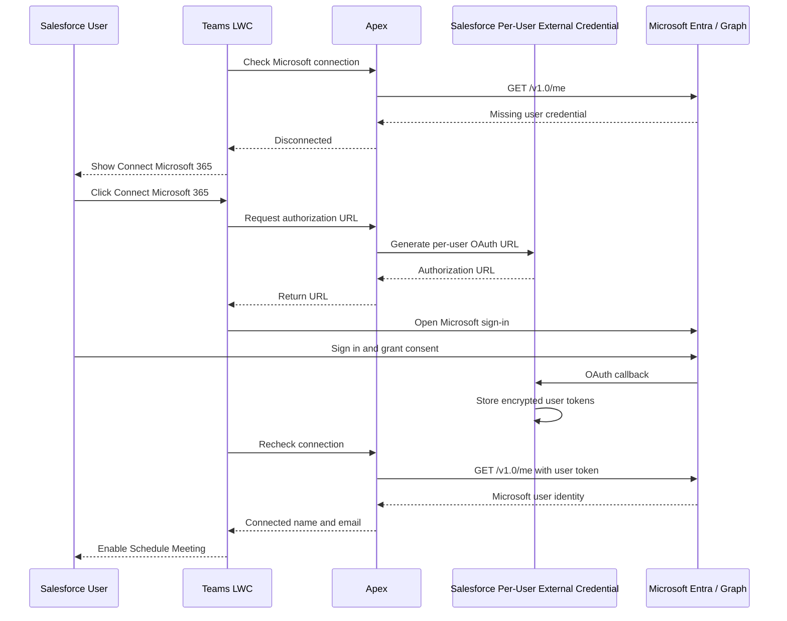

# Microsoft 365 per-user authentication flow

Interactive meeting operations use `callout:MicrosoftGraph/v1.0/me/...`. Salesforce attaches the current user's encrypted Microsoft OAuth token, so Microsoft creates the event with that user as its organizer.
